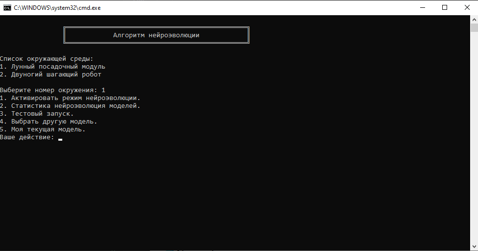
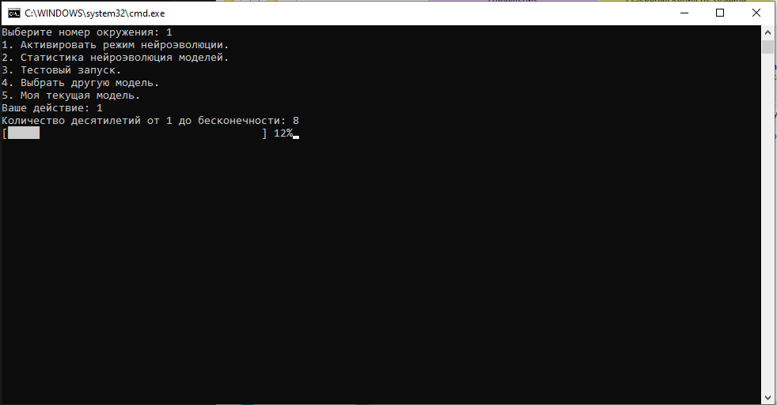
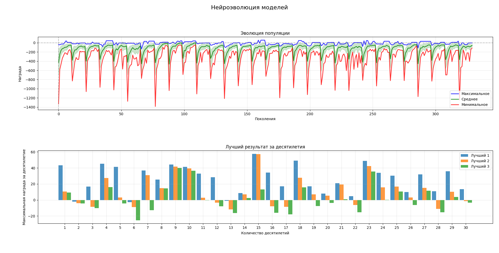
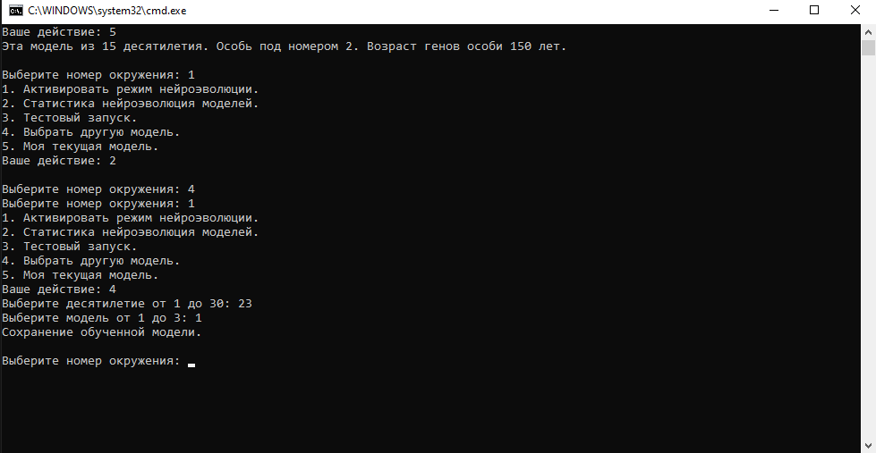
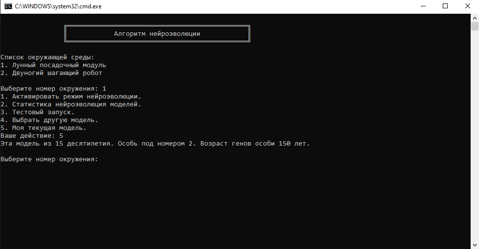
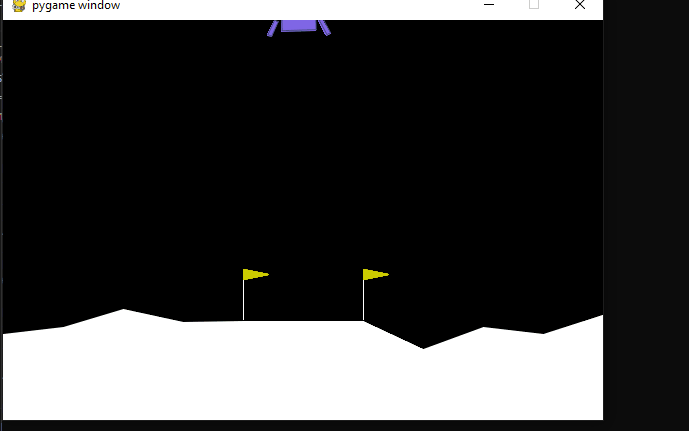

# Алгоритм нейроэволюции

Библиотека объединяет в себе нейронный и генетический алгоритм для обучения взаимодействия агента с окружающей средой из библиотеки `gymnasium.farama.org`.

Для настройки и добавления окружающей среды в программу предназначен файл `settings.py`.

Пример определений окружения:

```python

from pathlib import Path
from neuro_gym.environs import Environs, Complexity, torch, NeuroConfig

ROOT_DIR = Path(__file__).parent

Environs(
    id='LunarLander-v3',
    name='Лунный посадочный модуль',
    params={
        'id': 'LunarLander-v3',
        'continuous': False, 
        'gravity': -10.0, # 0 до -12.0
        'enable_wind': True,  # случайным образом в диапазоне от -9999 до 9999
        'wind_power': 20.0,  #  от 0 до 20.0
        'turbulence_power': 2.0 #  от 0 до 2.0
    },
    neuro_config=NeuroConfig(
        input_size=8, 
        output_size=4, 
        complexity=Complexity.LOW,
        calc_confidence=True,
        update_vector=lambda y: torch.argmax(y, dim=-1).item()
    )
)
...
```

Количество нейронов регулируется с помощью объекта `Complexity`. Он выставляет сложность корректирую количество скрытых нейронов.

В каждом окружение есть определенные параметры, которые можно передать при отображение сцены или для обучения в этих условиях.

Размер входного и выходного вектора зависит от окружения. Размер вектора и передаваемые параметры можно посмотреть в `gymnasium.farama.org`.

Параметр `update_vector` предназначен для корректировки данных для метода `action` после получения вектора из нейронной сети.

Этот параметр `calc_confidence` может быть использован для обучения уверенности нейронной сети к действию. Если одно из значений в выходящем векторе нейронной сети будет сильно отличаться от других, то эта сеть уверенна в своем действие. Такая особь при обучение получает дополнительное вознаграждения, если три попытки игры нейронной сети закончились с положительным результатом. 

Запуск программы производится через `start.bat` файл. Этот скрипт автоматически создаст виртуальное окружение и запустить программу.



После запуска будут доступны окружающие среди из настроек и действия применимые на них.

Для обучения моделей есть режим нейроэволюции. Он предназначен для улучшения показателей взаимодействия со сценой.



Каждый этап обучения и эволюции разбит на десятилетия. 

После окончания эволюции будет показана диаграмма и предложаны варианты выбора моделей для сохранения. Также есть возможность поспещно выйти из режима обучения `Ctrl+C`. Это тоже приведет к выбору моделей. 



На диаграмме снизу можно выбрать десятилетие и модель. В каждом десятилетии выбирается три лучших особи для сохранения в зал славы.

Позже будет представлена возможность зафиксировать свой выбор. Если у вас нет желания делать выбор сейчас, то вы можете закрыть программу и сделать выбор позже.



Если вам нужно узнать возраст вашей модели или какова была продолжительность обучения текущей модели, то можно выбрать действие 5.



Здесь представлена информация о текущей модели.

Приземление лунного модуля на поверхность луны с помощью нейронного агента.

