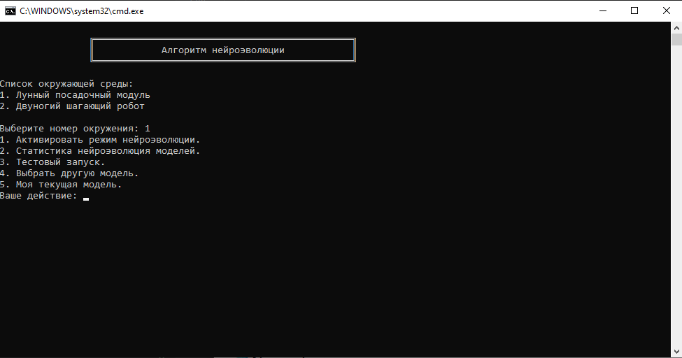
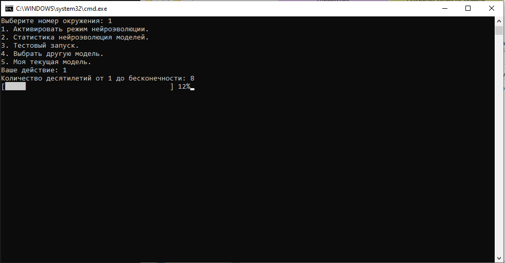
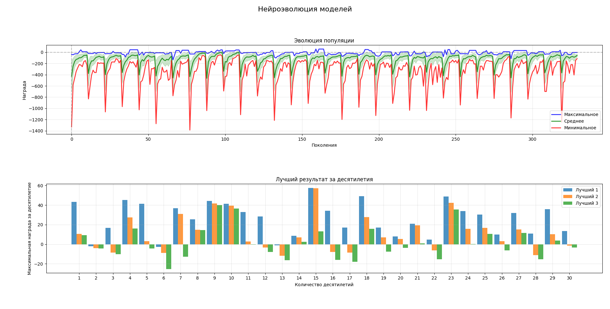
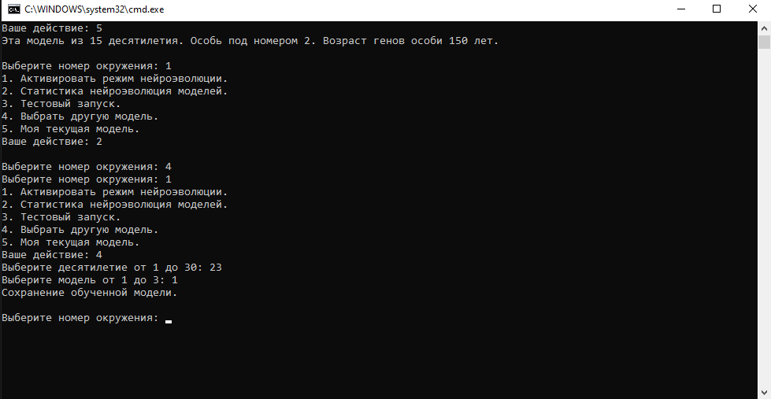
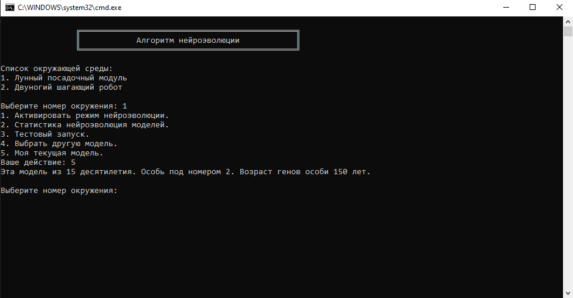
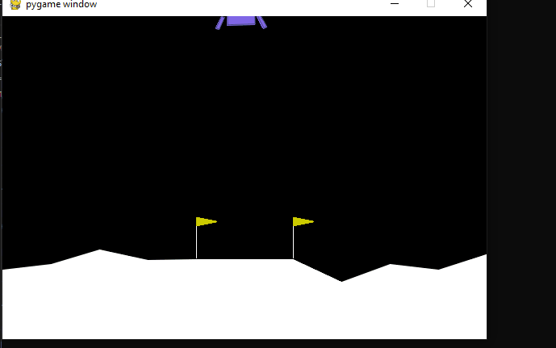

# Алгоритм нейроэволюции

Библиотека объединяет в себе нейронный и генетический алгоритм для обучения взаимодействия агента с окружающей средой из библиотеки `gymnasium.farama.org`.

Для настройки и добавления окружающей среды в программу нужно в папке `neuro_gym/environs` создать свой класс унаследованный от `from neuro_gym.environ import Environ`.

Пример для лунного посадочного модуля:

```python

from typing import Dict, Union
import torch
import numpy as np
from neuro_gym.environ import Environ, Complexity


class LunarLander(Environ):
    
    @property
    def id(self) -> str:
        return 'LunarLander-v3'
    
    @property
    def name(self) -> str:
        return 'Лунный посадочный модуль'
    
    @property
    def params(self) -> Dict:
        return {
            'id': self.id,
            'continuous': False, 
            'gravity': -10.0, # 0 до -12.0
            'enable_wind': True,  # случайным образом в диапазоне от -9999 до 9999
            'wind_power': 20.0,  #  от 0 до 20.0
            'turbulence_power': 2.0 #  от 0 до 2.0
        }
    
    @property
    def complexity(self) -> int:
        return Complexity.LOW
    
    @property
    def number_input_neurons(self) -> int: 
        return 8
    
    @property
    def number_output_neurons(self) -> int: 
        return 4
    
    @property
    def calc_confidence(self) -> bool: 
        return True
    
    def update_vector(self, output_vector: Union[np.ndarray, torch.Tensor]) -> int:
        return torch.argmax(output_vector, dim=-1).item()
```

И добавить импорт к файлу в `neuro_gym/environs/__init__.py`.

Запуск программы производится через `start.bat` файл. Этот скрипт автоматически создаст виртуальное окружение и запустить программу.



После запуска программы выведится список сцен.

Для обучения моделей есть режим нейроэволюции. Он предназначен для улучшения показателей взаимодействия со сценой.



Каждый этап обучения и эволюции разбит на десятилетия. 

После окончания эволюции будет показана диаграмма и предложаны варианты выбора моделей для сохранения. Также есть возможность поспещно выйти из режима обучения `Ctrl+C`. Это тоже приведет к выбору моделей. 



На диаграмме снизу можно выбрать десятилетие и модель. В каждом десятилетии выбирается три лучших особи для сохранения в зал славы.

Позже будет представлена возможность зафиксировать свой выбор. Если у вас нет желания делать выбор сейчас, то вы можете закрыть программу и сделать выбор позже.



Если вам нужно узнать возраст вашей модели или какова была продолжительность обучения текущей модели, то можно выбрать действие 5.



Здесь представлена информация о текущей модели.

Приземление лунного модуля на поверхность луны с помощью нейронного агента.

